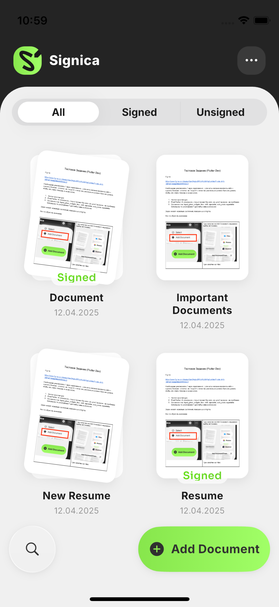
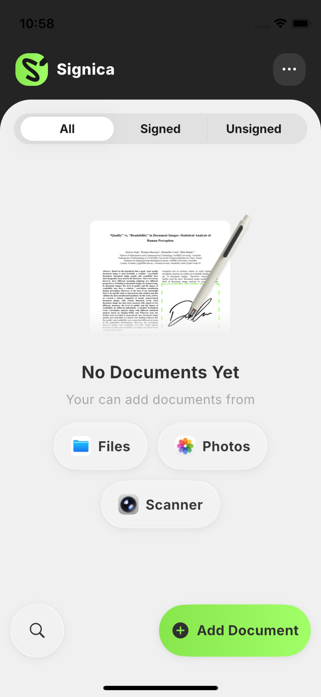

# Signica

Тестовое задание: главный экран приложения Signica — список PDF-документов с превью,
добавлением из Files / Photos / Scanner, поиском, фильтрами и подписью документа.

Макет: `docs/figma/*.png` (экспорт @3x), разбор макета в числах: `docs/ui-spec.md`.

| Список документов | Пустое состояние |
|---|---|
|  |  |

Скриншоты сняты на iPhone 13 mini — 375×812, ровно тот фрейм, на котором нарисован макет.

## Состояния экрана

- список документов с превью, фильтрами All / Signed / Unsigned и поиском;
- пустое состояние с выбором источника;
- оверлей «Add Document From»: контент под ним размывается, кнопка превращается в крестик;
- поиск: та же кнопка разворачивается в поле над клавиатурой, тап вне поля убирает клавиатуру;
- меню «…»: Select / Add Document;
- режим выбора: выделение карточек, Select All / Deselect All (n), удаление и шеринг;
- контекстное меню документа по долгому нажатию: Print / Share / Delete.

## Запуск

```bash
flutter pub get
dart run build_runner build          # drift, injectable, auto_route
cd ios && pod install && cd ..
flutter run                          # iOS 15+
```

Тесты и статический анализ:

```bash
flutter analyze                      # 0 issues
flutter test                         # 25 тестов
```

## Стек

| Слой | Инструменты |
|---|---|
| UI | `liquid_glass_widgets`, `flutter_svg` |
| Состояние | `flutter_bloc`, `bloc_concurrency`, `equatable` |
| Навигация | `auto_route` |
| DI | `injectable` + `get_it` |
| Хранилище | `drift` (SQLite), `path_provider` |
| Документы | `file_picker`, `image_picker`, `cunning_document_scanner`, `pdf`, `pdfrx` |
| Локализация | `easy_localization` |

## Архитектура

Чистая архитектура, три слоя, зависимости направлены к домену:

```
presentation ──▶ domain ◀── data
```

Домен не знает ни про Flutter, ни про drift, ни про платформенные пикеры — только
интерфейсы и use cases. Data реализует эти интерфейсы, presentation их вызывает.

```
lib/
  app/                                   каркас приложения
    di/injection.dart                    @InjectableInit + модуль сторонних синглтонов
    router/app_router.dart               auto_route
    theme/                               токены из Figma: цвета, типографика,
                                         шкала отступов, радиусы
    l10n/translation_keys.dart           ключи easy_localization
  core/
    result.dart                          sealed Result<T> = Ok | Err
    failure.dart                         sealed Failure: Picker/Permission/Storage/Pdf/Database
    use_case.dart                        UseCase / StreamUseCase / SyncUseCase
  features/documents/
    domain/
      entities/                          Document, DocumentSource, PickedSource, StoredPdf
      repositories/                      DocumentsRepository, DocumentImportService (интерфейсы)
      use_cases/                         import_document, resolve_document_name, watch_documents,
                                         toggle_signature, delete_documents
    data/
      db/                                drift: таблица, база, DAO, подключение
      sources/                           file_storage, pdf_processor, document_picker
      mappers/                           строка БД ↔ сущность
      repositories/                      реализации доменных интерфейсов
    presentation/
      bloc/                              DocumentsBloc + события и состояние
      pages/, widgets/                   экран и его виджеты
```

## Принятые решения

**Превью рендерятся один раз.** При добавлении документа `pdfrx` растеризует первую и —
если страниц больше одной — последнюю страницу в PNG (`assets` ширина 450 = 150pt × 3),
пути кладутся в БД. Сетка показывает `Image.file`, а не `PdfView`: скролл не упирается
в рендеринг PDF, а память не держит открытые документы.

**Состояние поиска не в блоке.** `DocumentsBloc` владеет данными: список, запрос, фильтр,
статус импорта. Открыт ли поиск, какой режим у нижней панели, что выделено — это состояние
виджета, оно живёт в нём. Граница проведена осознанно: в блок попадает то, что переживает
пересоздание виджета и влияет на данные.

**Список приходит стримом из drift.** Фильтрация и поиск выполняются в SQL, любая запись
автоматически перерисовывает сетку. Блок не перезапрашивает данные руками — только
переподписывается (`restartable`) при смене запроса или фильтра.

**Свой `Result` вместо `dartz`/`fpdart`.** Нужны ровно два случая; sealed-классы Dart 3
дают исчерпывающий `switch` и читаемые типы без функциональной библиотеки в домене.

**Дедупликация имён — чистая функция.** `ResolveDocumentName` принимает желаемое имя и
список занятых, возвращает `Name` → `Name 2` → `Name 3` по правилам iOS. Ни БД, ни файлов —
поэтому всё поведение покрыто таблицей юнит-тестов.

**Отмена пикера — не ошибка.** `PickerCancelled` отделён от остальных `Failure`: блок
гасит его молча, а настоящие сбои показывает.

**Системный SQLite на iOS.** `sqlite3_flutter_libs` собирает SQLite из исходников, которые
скачивает во время `pod install`; сборка начинает зависеть от сети. Схема не использует
ничего сверх обычного SQL, поэтому drift открывает системный `libsqlite3.dylib`
(`lib/features/documents/data/db/database_connection.dart`), и проект собирается
из чистого чекаута без внешней загрузки.

**В базе — относительные пути.** iOS меняет путь контейнера приложения между
установками, поэтому абсолютный путь, записанный в БД, после обновления перестаёт
резолвиться (превью пропадают). В строках лежит `documents/<id>.pdf`, репозиторий
собирает абсолютный путь под текущий контейнер (`FileStorage.absolute`).

**Вёрстка идёт от констрейнтов, а не от координат.** Правила — в
[`docs/layout-rules.md`](docs/layout-rules.md). Коротко: ширина элемента
приходит из доступного места (`Row` + `Expanded`, `LayoutBuilder`,
`AspectRatio`, `FractionallySizedBox`), в коде остаются только токены — высоты
контролов, радиусы, кегли, отступы. Числа из макета проверяются тестом, а не
зашиваются в дерево виджетов.

**Число колонок в сетке считается от ширины.** На фрейме 375 получается две
колонки по 150 из макета, на широком экране добавляется третья. Сетка — `Wrap`,
а не `GridView`: карточка растёт вместе с именем и размером системного шрифта, а
ряд выравнивается по самой высокой — фиксированная высота строки сломалась бы на
двухстрочном имени или при увеличенном Dynamic Type.

**Нижняя панель морфится через layout, а не через интерполяцию координат.**
Поле поиска — `Expanded` в `Row`: разворачиваясь, оно забирает свободное место,
сворачиваясь — отдаёт. Кнопка «Add Document» превращается в крестик, потому что
`AnimatedSize` следит за сменой её содержимого; ширина нигде не анимируется
руками.

**Переменные шрифты.** Inter и Sora подключены как variable-шрифты; вес задаётся осью
`wght` через `FontVariation` в `AppTypography` — ровно те значения, что стоят в Figma,
без синтетического жирного начертания.

## Как использовался ИИ

| Зона | Кто делал |
|---|---|
| Вёрстка: дерево виджетов, отступы, анимации | руками |
| Архитектура, интерфейсы, контракты, сигнатуры | руками, до генерации |
| Реализация бизнес-логики по этим контрактам | ИИ |
| Перенос design-токенов из Figma в тему | ИИ по данным Figma API |
| Тесты | ИИ, разбор кейсов — руками |
| Сверка вёрстки со скриншотом макета | ИИ как ревьюер |

Интерфейсы ИИ не генерирует. Числа из макета — это измерение, а не генерация
вёрстки: они переносятся в код руками и округляются до значений, которыми удобно
пользоваться.

## Упрощения (по условиям задания)

- Подпись документа — переключение состояния по одному тапу, без реального ввода подписи.
- Локализация только `en`; все строки вынесены в `assets/translations/en.json`.

## Тесты

- `resolve_document_name_test` — правила дедупликации имён, включая регистр, пропуски в
  нумерации и имя с цифрой на конце.
- `documents_dao_test` — drift на in-memory базе: сортировка, фильтры, поиск, обновление
  стрима после записи, удаление.
- `documents_bloc_test` — подписка, дебаунс поиска, смена фильтра, импорт (успех, отмена,
  ошибка, защита от повторного запуска), переключение подписи.

На устройстве (`flutter test integration_test -d <device>`, 17 тестов):

- `pdf_pipeline_test` — сборка многостраничного PDF из изображений и рендер превью:
  проверяется в том числе, что превью последней страницы отличается от первой.
- `documents_screen_test` — соответствие вёрстки макету числами из `docs/ui-spec.md`
  (ширина карточки 150 и колонки на x=28 / x=197, трек контрола 343×36, пилюли 128
  в оверлее) плюс поведение: тап по карточке, открытие оверлея источников, старт
  импорта, разворот поиска с дебаунсом, меню и вход в режим выбора; отдельно —
  что кнопка ловит тап по всей своей поверхности, а не только по глифу.
- там же группа `adaptivity` — экран на iPhone SE при `textScaler` 1.3 (карточки
  не обрезаются, ряд выравнивается по самой высокой) и в landscape (сетка
  раскладывается в четыре колонки, а не сжимает карточки).
